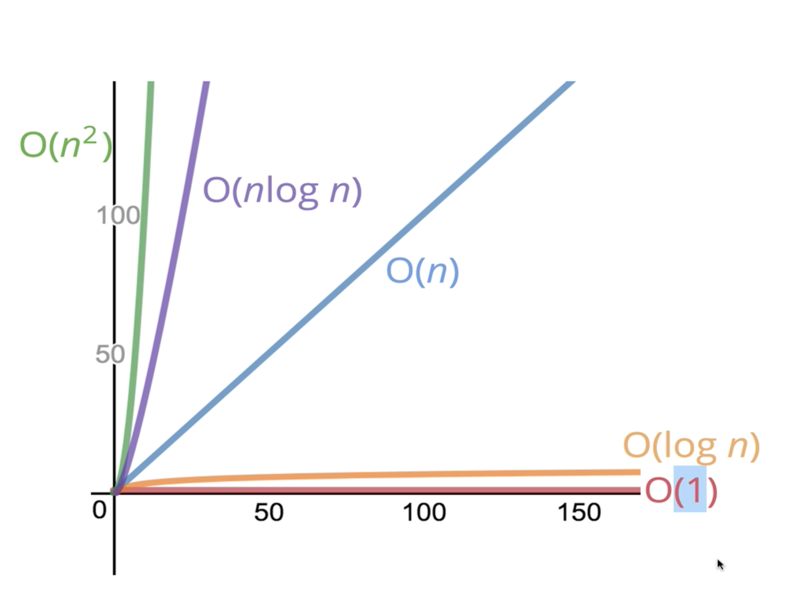

# Data Structures and Algorithm

## Big O Notation
  * Used to compare and rate different working implementations
  * Allows us to talk formally about **how runtime of algo grows as input grows**
  * considers upper bound, worst case senario
  * doesnt care about precision just general trend

  1. ### Time Complexity
      ```
      Problem - Add numbers from 0 upto n including n   
          
      Approch 1 - initialize total=0, using a loop and adding each no   
      Time Taken ~ 1.5 sec   
      As n grows, no of operations grow roughly in proportion to n ---> O(n)
        
      Approch 2 - sum till n = n * (n-1) / 2   
      Time Taken ~ 0.001 sec   
      3 simple operations regardless to the size of n ---> O(1)
      ``` 

      Common Time complexities
      * no loops -> O(1)
      * one loop -> O(n)
      * two loops -> O(2n) -> O(n)
      * two nested loops -> O(n<sup>2</sup>)

      Comparison of common time complexities   
      

      ```
      // Determine the time complexity for the following function 

      function logAtMost10(n) {
          for (var i = 1; i <= Math.min(n, 10); i++) {
              console.log(i);
          }
      }

      // O(1) - no mater what n is it runs 10 times
      ```

  2. ### Space Complexity
      Space required by the algorithm, not including space taken by the inputs   

      Rules of thumb to calculate space complexity
      * Most primitives (nos, chars, booleans, undefined, null) are constant space
      * String require n (length of string) space
      * Arrays, objects require n (length of arrays, keys of object)space 

      ```
      // Determine the space complexity for the following function 

      function onlyElementsAtEvenIndex(array) {
          var newArray = Array(Math.ceil(array.length / 2));
          for (var i = 0; i < array.length; i++) {
              if (i % 2 === 0) {
                  newArray[i / 2] = array[i];
              }
          }
          return newArray;
      }


      // O(n) - if n is 10 space req is 5, n=100 50, n=200 100 ... increases linerly with n
      ```

  3. ### Logarithms
      Logarithm is the inverse of exponentiation

      log<sub>2</sub>(8) = 3      -------->      2<sup>3</sup> = 8

      ```
      Binary Logarithm of a number roughly measures the no of times you can divide the no by 2 
      before you get a value less then or equal to 1
      ```

---       
## Analysing Performance of Arrays and Objects
  * ### Objects
    * unordered, key value pairs
    * Values are reffered by keys, firstName, color, etc
    * Use objects when you dont need order
    * when you need fast access, insertion and removal
    * BigO of objects - Access O(1), Insertion O(1), Removal O(1), Searching O(n)
    * BigO of predefined methods - Object.keys O(n), Object.values O(n), Object.entries O(n), Object.hasOwnProperty O(1)

  * ### Arrays
    * Arrays are ordered
    * Values are reffered by indexes, 0th item, 1st item...
    * Use arrays when you **need order**
    * BigO of Arrays - Access O(1), Searching O(n)
    * Insertion/Removal at end O(1), insertion/removal at begining O(n) as we have to shift all existing values
    * shift() and unshift() is much costlier then push() and pop()

    * BigO of array methods
        * push() pop() - O(1)
        * shift() unshift() - O(n)
        * concat() - O(n+m) -> O(n)
        * slice() splice() - O(n) as rest part needs to be reordered
        * sort() - O(n log n) VERY EXPENSIVE
        * forEach, map, filter, reduce - O(n) process each element once

---       
## Problem Solving Patterns
1. ### Frequency Counter Pattern
    ```The Idea behind frequency counter is use an object to construct a profile of an array or a string```   
    \
    <u>Example</u>   
    Write a function 'same' which accepts two arrays,    
    The function should return true if every value in the array has its corresponding value squared in second array,    
    The frequency of values must be same   
    same([1, 2, 3], [4, 1, 9]) // true   
    same([3, 4, 2], [4, 16]) // false   
    same([1, 2, 1], [4, 4, 1]) // false   

    ```
    function same(arr1=[], arr2=[]){
      let result = true;
      arr1.forEach(value => {
        const index = arr2.indexOf(value * value);
        if(index < 0){
          result = false;
          return result;
        }
        arr2.splice(index, 1);
      });
      return result;
    }

    // forEach O(n), indexOf O(n), splice O(n) ---> O(n*n)
    ```

    ```
    // frequency counter refactored
    function same(arr1=[], arr2=[]){
      const freq1 = {};
      const freq2 = {};
      arr1.forEach(val => freq1[val] ? (freq1[val] += 1) :  (freq1[val] = 1));
      arr2.forEach(val => freq2[val] ? (freq2[val] += 1) :  (freq2[val] = 1));
      for(let key in freq1){
        if(!freq2[key * key]){
          return false;
        }
        if(freq1[key] !== freq2[key * key]){
          return false;
        }
      }
      return true;
    }

    // forEach O(n), for O(n) ---> O(3n) ----> O(n)
    ```


1. ### Multiple Pointers Pattern
   ```Create pointers that correspond to an index or position, and move toward the beginning end or middle based on condition.  mostly used on sorted linear structures```  
   \
    <u>Example 1 - One pointer from left and one from right</u>   
    Write a function 'sumZero' which accepts **sorted array** of integers,    
    The function should return first pair where sum is 0,   
    Return an array that includes both nos that sum upto 0 or undefined if pair doesnt exist    
    sumZero([-3, -2, -1, 0, 1, 2, 3]) // [-3, 3]   
    sumZero([-2, 0, 1, 3]) // undefined      
    sumZero([-4, -3, -2, -1, 0, 1, 2, 5]) // [-2, 2]   
    sumZero([-4, -3, -2, -1, 0, 1, 2, 3, 10]) // [-3, 3]  

    ```
    // brute force
    function sumZero(arr=[]){
      for(let i=0; i < arr.length; i++){
        for(let j=i+1; j < arr.length; j++){
          if(arr[i] + arr[j] === 0){
            return [arr[i], arr[j]];
          }
        }
      }
    }

    // nested loop ---> O(n*n)
    ```

    ```
    // multiple pointers one from left and one from right
    function sumZero(arr=[]){
      let left = 0;
      let right = arr.length -1;
      while(left < right){
        const sum = arr[left] + arr[right];
        if(sum === 0){
          return [arr[left], arr[right]];
        }
        sum > 0 ? right-- : left++ ;
      }
    }

    // while loop ---> O(n)
    ``` 

    \
    <u>Example 2 - </u>   
    Write a function 'countUniqueValues' which accepts **sorted array** of integers, and counts unique values in the array    
    countUniqueValues([1, 1, 1, 1, 1, 3]) // 2  
    countUniqueValues([1, 2, 3, 4, 4, 4, 7, 7, 12, 12, 13]) // 7      
    countUniqueValues([]) // 0  
    countUniqueValues([-2, -1, -1, 0, 1]) // 4  

    ```
    // brute force - use set or maybe hash n increase count when new value put into hash
    function countUniqueValues(arr=[]){
      const set = new Set(arr);
      return set.size;
    }
    ```

    ```
    // multiple pointers refactored ---> O(n)
    function countUniqueValues(arr=[]){
      let count = 0;
      let ptr1 = 0;
      let ptr2 = 1;
      while(ptr2 <= arr.length){
        if(arr[ptr1] === arr[ptr2]){
          ptr2++;
        } else {
          count++;
          ptr1 = ptr2;
          ptr2++;
        }
      }
      return count;
    }
    ``` 
1. ### Sliding Window Pattern
    ```This pattern is useful when we have an array or string and we are looking for a subset of data that is continuous```   
    \
    <u>Example</u>   
    write a function maxSubarraySum which accepts an array of integers and a number called n.  
    The function should calculate the maximum sum of n consequitive elements in an array.  
    maxSubarraySum([1,2,5,2,8,1,5], 2) // 10  
    maxSubarraySum([1,2,5,2,8,1,5], 4) // 17  
    maxSubarraySum([4,2,1,6], 1) // 6  
    maxSubarraySum([4,2,1,6,2], 4) //  13  

    ```
    // brute force --> O(n*m)
    function maxSubarraySum(arr=[], num){
      if(num > arr.length) { return null }
      let max = -Infinity;
      for(var i=0; i<= arr.length - num ; i++ ){
        let temp = 0
        for(j=i ; j< i + num ; j++){
          temp += arr[j];
        }
        max = (temp > max) ? temp : max;
      }
      return max;
    }    
    ```

    ```
    // sliding window --> O(m + n)
    function maxSubarraySum(arr=[], num){
      if(num > arr.length) { return null }
      let max = 0;
      let tempSum = 0;
      for(var i=0; i< num ; i++){
        tempSum += arr[i];
      }
      max = (tempSum > max) ? tempSum : max;
      for(var j=num ; j<arr.length ; j++){
        tempSum = tempSum + arr[j] - arr[j-num];
        max = (tempSum > max) ? tempSum : max;
      }
      return max;
    }
    ```
1. ### Divide and Conquer Pattern
    ```This pattern involves dividing a dataset into smaller chunks and then repeating a process with a subset of data```   

   * Quick sort and Merge sort are examples of divide and conquer 
   * Binary serch is also an example of divide and conquer 

   Example   
   Given a **sorted array** and a value, write a function search which returns index of value in that array  
   return -1 if value not found   
   search([1, 4, 6, 9, 44, 60], 9) // 3

    ```
    // Linear Search - O(n)
    function search(arr, val){
      for(let i=0; i< arr.length; i++){
        if(arr[i] === val){ return i }
      }
      return -1;
    }
    ```

    ```
    // Binary Search - O(log n)
    ```

* ### Tips
  * To avoid encountering duplicates again, splice them off
  * To remove duplicates, make a set

---       
## Recursion
  A function that calls itself, until it reaches a base case
  
  Recursion is used by
  * JSON parse / JSON stringify
  * document.getElementById and DOM traversal algorithms
  * tree / graph traversals

  ### The call stack
  * A built in data structure that manages what happens when functions are invoked
  * uses the stack data structure
  * when a function is invoked it is pushed on top of stack, when return is seen or function ends it is poped
  * observe the call stack in dev tools by adding breakpoints to the snippet

  Example - Factorial
  ```
  // Iterative way

  function factorial(num){
    let total = 1;
    for(var i=num ; i > 1 ; i--){
      total = total * i;
    }
    return total;
  }
  ```

  ```
  // Recursion

  function factorial(num){
    if (num === 1) return 1;
    return num * factorial(num - 1);
  }
  ```

### Helper Method Recursion
* A **design pattern** to use recursion for arrays and strings 
* We have an outer function and inside the outer function we have an recursive helper function which calls itself
* The reason we do this is say we deifine result = [ ], whenever the recursive function calls itself the **Result will reset**

Example - Find all odds in a array using Helper Method Recursion
```
function collectOddValues(arr){
  let result = [];
  function helper(input){
    if (input.length === 0) return;  // base condition
    if (input[0] % 2 !== 0) result.push(input[0])
    helper(input.slice(1));
  }

  helper(arr);
  return result;
}
```

---       
## Searching Algorithms (Linear, Binary, Naive)
---       
## Sorting Algorithms (Bubble, Selection, Insertion, Merge, Quick, Radix)
---       
## Data Structures (Classes and Instances)
---       
## Recursion
---       
## Singly Linked Lists 
---       
## Doubly Linked Lists 
---       
## Stack and Queues
---       
## Binary Search Tree
---       
## Tree Traversal
---       
## Binary Heaps
---       
## Hash Table
---       
## Graphs
---       
## Graph Traversal
---       
## Dijkstras Algorithm
---       
## Dynamic Programming
---       
## Wild West
