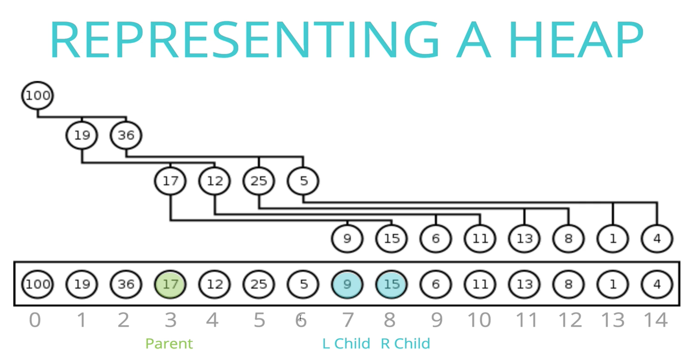

# Data Structures and Algorithm

## Key Takeaways
  * Accept n no of arguments in javascript - use arguments keyword or spread operator
  ```javascript
  function multipleArguments(...arr) { return arr.sort();}
  ```
  * To avoid encountering duplicates again, splice them off
  * To remove duplicates, make a set
  * **BFS is implemented using Queue,**   
    **DFS is implemented using Stack or Recursion (which internally uses Call Stack)**
  * Whenever a function has to return either True/False, initially set result to True, if at any point condition fails set it to False, break, and return result.
  * Whenever a Problem has a **sorted structure**, Try using **Multiple Pointers Pattern with while loop** before Frequency Counter Pattern
  * Whenever we have an **array or string** and we are looking for a **continuous subset of data, use Sliding Window Pattern**
  * For **Dynamic programming** - **Visualise the problem as a tree** (nodes represnent arguments, the problem should shrink to smaller sub problems eventually base cases)
  * Two methods to solve problems with **Dynamic Programming**   
    **Memoization - Storing the results in memo and passing it to every call**      
    **Tabulation - Storing the result of a previous result in a table (usually an array), Usually done using iteration**  
  * `sum = (n*(n-1))/2`  Guass formula to compute the **sum of the first n natural numbers in constant time**
  * When numbers from 1 to n are mentioned in an array use `sum = (n*(n-1))/2`
  * XOR operator can be used in many problems
    * If we take XOR of zero and some bit, it will return that bit `a ^ 0 = a`
    * If we take XOR of two same bits, it will return 0 `a ^ a = 0`
    * XOR all bits together to find the **unique number** `a ^ b ^ c ^ a ^ c = b` 
  * Logarithm is the inverse of exponentiation       
    log<sub>2</sub>(8) = 3      -------->      2<sup>3</sup> = 8   
  * Binary Logarithm of a number roughly measures the no of times you can divide the no by 2 
      before you get a value less then or equal to 1

---

## Dynamic Programming Takeaways 
* Refer - https://www.youtube.com/watch?v=oBt53YbR9Kk&t=4321s
* If the **Brute force solution ---> O(2 ^ n)**, it is probably a DP question
* For **Dynamic programming** - **Visualise the problem as a tree** (nodes represnent arguments, the problem should shrink to smaller sub problems eventually base cases)
* Two methods to solve problems with **Dynamic Programming**   
  **Memoization - Storing the results in memo and passing it to every call**      
  **Tabulation - Storing the result of a previous result in a table (usually an array), Usually done using iteration**  

* ### For a problem whose solution will be Recursive, Visualize it like a tree
  If there is a choice between two options,    
  eg Right/Down in grid_traversal_memoization_dp, Add/Subtract in dp_target_sum.js   
  Represent them as left and right child of tree

* To represent a problem of checkSum into tree -
checkSum(7, [5, 4, 3, 7]) -> true
checkSum(7, [2, 4]) -> false

     
  

---


### Memoization Recipe

1. Make It Work
* Visualise as a tree (nodes represnent arguments, the problem should shrink to smaller sub problems eventually base cases)
* Implement tree using recursion
* Test it

1. Make Efficient
* Add a memo object (keys representing arguments and value represnting return values for those arguments)
* Pass memo object with all recursive calls
* Add base case to check memo object
* Store calculate return values in the memo

---

### Tabulation Recipe


---
## 

* Understanding time and space complexities of FIBONACI RECURSIVE Problem    
  ```javascript
  const foo(n) => {
    if(n <= 1) return;
    foo(n-1);
  }


  // Time complexity - O(n)   
  // Space complexity - O(n)
  ```

  ```javascript
  const bar(n) => {
    if(n <= 1) return;
    bar(n-2);
  }


  // Time complexity - O(n)   
  // Space complexity - O(n)
  ```

  ```javascript
  const dib(n) => {
    if(n <= 1) return;
    dib(n-1);
    dib(n-1);
  }


  // Time complexity - O(2 ^ n)   
  // Space complexity - O(n)
  ```

  

  Space Complexity is O(n), Once a base case is reached the stack frame is popped out of the stack ,and once the left child is removed after that the right child is added
  Hence at any point there are only n calls in call stack, which is clear in the visual   
  
  

---

## Backtracking

* Backtracking is an algorithmic technique that considers searching in every possible combination for solving a computational problem.
* It is known for solving problems recursively one step at a time and removing those solutions that that do not satisfy the problem constraints at any point of time.
* It is a refined brute force approach that tries out all the possible solutions and chooses the best possible ones out of them.

### If the current solution is not suitable, then eliminate that and backtrack (go back) and check for other solutions.


   

Backtracking Pseudocode 
```javascript
function pathFound(Position p) {
  if (p is finish) return true;
  
  foreach option O from p {
    boolean isThereAPath = pathFound(O);
    if (isThereAPath) return true; // We found a path using option O
  }
  // We have tried all options from this position and none of the options lead to finish. 
  // Hence there is no solution possible to finish
  return false;
}
```

---

## Big O Notation
  * Used to compare and rate different working implementations
  * Allows us to talk formally about **how runtime of algo grows as input grows**
  * considers upper bound, worst case senario
  * doesnt care about precision just general trend

  1. ### Time Complexity
      ```
      Problem - Add numbers from 0 upto n including n   
          
      Approch 1 - initialize total=0, using a loop and adding each no   
      Time Taken ~ 1.5 sec   
      As n grows, no of operations grow roughly in proportion to n ---> O(n)
        
      Approch 2 - sum till n = n * (n-1) / 2   
      Time Taken ~ 0.001 sec   
      3 simple operations regardless to the size of n ---> O(1)
      ``` 

      Common Time complexities
      * no loops -> O(1)
      * one loop -> O(n)
      * two loops -> O(2n) -> O(n)
      * two nested loops -> O(n<sup>2</sup>)

      Comparison of common time complexities   
      


      On a grand scale  
      

      ```javascript
      // Determine the time complexity for the following function 

      function logAtMost10(n) {
          for (var i = 1; i <= Math.min(n, 10); i++) {
              console.log(i);
          }
      }

      // O(1) - no mater what n is it runs 10 times
      ```

  2. ### Space Complexity
      Space required by the algorithm, not including space taken by the inputs   

      Rules of thumb to calculate space complexity
      * Most primitives (nos, chars, booleans, undefined, null) are constant space
      * String require n (length of string) space
      * Arrays, objects require n (length of arrays, keys of object)space 

      ```javascript
      // Determine the space complexity for the following function 

      function onlyElementsAtEvenIndex(array) {
          var newArray = Array(Math.ceil(array.length / 2));
          for (var i = 0; i < array.length; i++) {
              if (i % 2 === 0) {
                  newArray[i / 2] = array[i];
              }
          }
          return newArray;
      }


      // O(n) - if n is 10 space req is 5, n=100 50, n=200 100 ... increases linerly with n
      ```

  3. ### Logarithms
      Logarithm is the inverse of exponentiation

      log<sub>2</sub>(8) = 3      -------->      2<sup>3</sup> = 8

      
      > Binary Logarithm of a number roughly measures the no of times you can divide the no by 2 
      before you get a value less then or equal to 1

      log(4 billion something) ---> 32   
      log(8 billion something) ---> 33    
      log(16 billion something) ---> 34    
      
      ### When input doubles, time to execute increases by just one operation
          
      > Time to execute an Algorithm with O(n) complexity, 4 billion input size ~ 4 Billion nanoseconds ~ 4 days   
      > Time to execute an Algorithm with O(log n) complexity, 4 billion input size ~ 32 nanoseconds ~ almost instant

  4. ### 2<sup>n</sup> Time Complexity
          
          
      For a problem like following, Each node represnts one operation to be done   
      Since the root (level 1) will have one node, and each following level will have 2*node of parent   
      total time taken = 1 * 2 * 2 * 2 ....(n times)   
      which is   2<sup>n</sup>    
      **The space complexity for this problem is O(n)** as we reach base case it returns a value    
      Whenever a new node is added to the stack, an older value return n goes out, hence space complexity stays O(n)


---       
## Analysing Performance of Arrays and Objects
  * ### Objects
    * unordered, key value pairs
    * Values are reffered by keys, firstName, color, etc
    * Use objects when you dont need order
    * when you need fast access, insertion and removal
    * BigO of objects - Access O(1), Insertion O(1), Removal O(1), Searching O(n)
    * BigO of predefined methods - Object.keys O(n), Object.values O(n), Object.entries O(n), Object.hasOwnProperty O(1)

  * ### Arrays
    * Arrays are ordered
    * Values are reffered by indexes, 0th item, 1st item...
    * Use arrays when you **need order**
    * BigO of Arrays - Access O(1), Searching O(n)
    * Insertion/Removal at end O(1), insertion/removal at begining O(n) as we have to shift all existing values
    * shift() and unshift() is much costlier then push() and pop()

    * BigO of array methods
        * push() pop() - O(1)
        * shift() unshift() - O(n)
        * concat() - O(n+m) -> O(n)
        * slice() splice() - O(n) as rest part needs to be reordered
        * sort() - O(n log n) VERY EXPENSIVE
        * forEach, map, filter, reduce - O(n) process each element once

---       
## Problem Solving Patterns
1. ### Frequency Counter Pattern
    > The Idea behind frequency counter is use an object to construct a profile of an array or a string      

    <u>Example</u>   
    Write a function 'same' which accepts two arrays,    
    The function should return true if every value in the array has its corresponding value squared in second array,    
    The frequency of values must be same   
    same([1, 2, 3], [4, 1, 9]) // true   
    same([3, 4, 2], [4, 16]) // false   
    same([1, 2, 1], [4, 4, 1]) // false   

    ```javascript
    function same(arr1=[], arr2=[]){
      let result = true;
      arr1.forEach(value => {
        const index = arr2.indexOf(value * value);
        if(index < 0){
          result = false;
          return result;
        }
        arr2.splice(index, 1);
      });
      return result;
    }

    // forEach O(n), indexOf O(n), splice O(n) ---> O(n*n)
    ```

    ```javascript
    // frequency counter refactored
    function same(arr1=[], arr2=[]){
      const freq1 = {};
      const freq2 = {};
      arr1.forEach(val => freq1[val] ? (freq1[val] += 1) :  (freq1[val] = 1));
      arr2.forEach(val => freq2[val] ? (freq2[val] += 1) :  (freq2[val] = 1));
      for(let key in freq1){
        if(!freq2[key * key]){
          return false;
        }
        if(freq1[key] !== freq2[key * key]){
          return false;
        }
      }
      return true;
    }

    // forEach O(n), for O(n) ---> O(3n) ----> O(n)
    ```
    \
    <u>Example 2 - </u>   
    Given two strings, determine if second string is the anagram of first   
    An anagram is a word formed by rearranging letters of another such as cinema from iceman      
    validAnagram('', '') // true   
    validAnagram('cinema', 'iceman') // true   
    validAnagram('anagram', 'nagaram') // true   
    validAnagram('aaz', 'zza') // false    
    validAnagram('rat', 'car') // false    
    validAnagram('awesome', 'awesom') // false    

    ```javascript
    function validAnagram(str1='', str2=''){
      if(str1.length !== str2.length) return false;
      const hash = {};
      for(var i in str1) { hash[str1[i]] ? hash[str1[i]] += 1 : hash[str1[i]] = 1 };
      for( var i in str2){
        if(!hash[str2[i]]){
          return false;
        }
        hash[str2[i]] -= 1;
      }
      return true;
    }
    ``` 


1. ### Multiple Pointers Pattern
   > Create pointers that correspond to an index or position, and move toward the beginning end or middle based on condition.  mostly used on sorted linear structures   

    <u>Example 1 - One pointer from left and one from right</u>   
    Write a function 'sumZero' which accepts **sorted array** of integers,    
    The function should return first pair where sum is 0,   
    Return an array that includes both nos that sum upto 0 or undefined if pair doesnt exist    
    sumZero([-3, -2, -1, 0, 1, 2, 3]) // [-3, 3]   
    sumZero([-2, 0, 1, 3]) // undefined      
    sumZero([-4, -3, -2, -1, 0, 1, 2, 5]) // [-2, 2]   
    sumZero([-4, -3, -2, -1, 0, 1, 2, 3, 10]) // [-3, 3]  

    ```javascript
    // brute force
    function sumZero(arr=[]){
      for(let i=0; i < arr.length; i++){
        for(let j=i+1; j < arr.length; j++){
          if(arr[i] + arr[j] === 0){
            return [arr[i], arr[j]];
          }
        }
      }
    }

    // nested loop ---> O(n*n)
    ```

    ```javascript
    // multiple pointers one from left and one from right
    function sumZero(arr=[]){
      let left = 0;
      let right = arr.length -1;
      while(left < right){
        const sum = arr[left] + arr[right];
        if(sum === 0){
          return [arr[left], arr[right]];
        }
        sum > 0 ? right-- : left++ ;
      }
    }

    // while loop ---> O(n)
    ``` 

    \
    <u>Example 2 - </u>   
    Write a function 'countUniqueValues' which accepts **sorted array** of integers, and counts unique values in the array    
    countUniqueValues([1, 1, 1, 1, 1, 3]) // 2  
    countUniqueValues([1, 2, 3, 4, 4, 4, 7, 7, 12, 12, 13]) // 7      
    countUniqueValues([]) // 0  
    countUniqueValues([-2, -1, -1, 0, 1]) // 4  

    ```javascript
    // brute force - use set or maybe hash n increase count when new value put into hash
    function countUniqueValues(arr=[]){
      const set = new Set(arr);
      return set.size;
    }
    ```

    ```javascript
    // multiple pointers refactored ---> O(n)
    function countUniqueValues(arr=[]){
      let count = 0;
      let ptr1 = 0;
      let ptr2 = 1;
      while(ptr2 <= arr.length){
        if(arr[ptr1] === arr[ptr2]){
          ptr2++;
        } else {
          count++;
          ptr1 = ptr2;
          ptr2++;
        }
      }
      return count;
    }
    ``` 
1. ### Sliding Window Pattern
    > This pattern is useful when we have an array or string and we are looking for a subset of data that is continuous   
    
    <u>Example</u>   
    write a function maxSubarraySum which accepts an array of integers and a number called n.  
    The function should calculate the maximum sum of n consequitive elements in an array.  
    maxSubarraySum([1,2,5,2,8,1,5], 2) // 10  
    maxSubarraySum([1,2,5,2,8,1,5], 4) // 17  
    maxSubarraySum([4,2,1,6], 1) // 6  
    maxSubarraySum([4,2,1,6,2], 4) //  13  

    ```javascript
    // brute force --> O(n*m)
    function maxSubarraySum(arr=[], num){
      if(num > arr.length) { return null }
      let max = -Infinity;
      for(var i=0; i<= arr.length - num ; i++ ){
        let temp = 0
        for(j=i ; j< i + num ; j++){
          temp += arr[j];
        }
        max = (temp > max) ? temp : max;
      }
      return max;
    }    
    ```

    ```javascript
    // sliding window --> O(m + n)
    function maxSubarraySum(arr=[], num){
      if(num > arr.length) { return null }
      let max = 0;
      let tempSum = 0;
      for(var i=0; i< num ; i++){
        tempSum += arr[i];
      }
      max = (tempSum > max) ? tempSum : max;
      for(var j=num ; j<arr.length ; j++){
        tempSum = tempSum + arr[j] - arr[j-num];
        max = (tempSum > max) ? tempSum : max;
      }
      return max;
    }
    ```
1. ### Divide and Conquer Pattern
    > This pattern involves dividing a dataset into smaller chunks and then repeating a process with a subset of data   

   * Quick sort and Merge sort are examples of divide and conquer 
   * Binary serch is also an example of divide and conquer 

   Example   
   Given a **sorted array** and a value, write a function search which returns index of value in that array  
   return -1 if value not found   
   search([1, 4, 6, 9, 44, 60], 9) // 3

    ```javascript
    // Linear Search - O(n)
    function search(arr, val){
      for(let i=0; i< arr.length; i++){
        if(arr[i] === val){ return i }
      }
      return -1;
    }
    ```

    ```
    // Binary Search - O(log n)
    ```

---
## Tips and Tricks
  ```javascript
  // Traverse deeply nested object using recursion

  function nestedLoop(obj) {
    const res = {};
    function recurse(obj, current) {
      for (const key in obj) {
        let value = obj[key];
        if(value != undefined) {
          if (value && typeof value === 'object') {
            recurse(value, key);
          } else {
            // Do your stuff here to var value
            res[key] = value;
          }
        }
      }
    }
    recurse(obj);
    return res;
  }
  ```

  ```javascript
  // Traverse deeply nested object and append keys
  
  function getArray(obj) {
    const result = [];
    function traverseObject(obj, current, appendedKeys='') {
      for (const key in obj) {
        let value = obj[key];
        if(value != undefined) {
          if (value && typeof value === 'object') {
            if(key === 'amount'){
              const data = {};
              data[appendedKeys] = value.value;
              result.push(data);
            } else {
              traverseObject(value, key, appendedKeys.concat(key));
            }
          }
        }
      }
    }
    traverseObject(obj);
    return result;
  }
  ```

  ```javascript
  // Accept n no of arguments in javascript - use arguments keyword or spread operator

  function multipleArguments(...arr){ 
    return arr.sort();
  }

  ```

---       
## Recursion
  A function that calls itself, until it reaches a base case
  
  Recursion is used by
  * JSON parse / JSON stringify
  * document.getElementById and DOM traversal algorithms
  * tree / graph traversals

  ### The call stack
  * A built in data structure that manages what happens when functions are invoked
  * uses the stack data structure
  * when a function is invoked it is pushed on top of stack, when return is seen or function ends it is poped
  * observe the call stack in dev tools by adding breakpoints to the snippet

  Example 1 - Factorial
  ```javascript
  // Iterative way

  function factorial(num){
    let total = 1;
    for(var i=num ; i > 1 ; i--){
      total = total * i;
    }
    return total;
  }
  ```

  ```javascript
  // Recursion

  function factorial(num){
    if (num === 1) return 1;
    return num * factorial(num - 1);
  }
  ```

  Example 2 - Fibonaci   
  using recursion write a function that returns nth no in fibonaci series. Fibonaci seq - 1, 1, 2, 3, 5, 8, 13   
  fib(4) // 3   
  fib(5) // 5   
  fib(10) // 55   

  ```javascript
  function fib(n){
    if(n <= 2) return 1;
    return fib(n-1) + fib(n - 2);
  }
  ```

### Helper Method Recursion
* A **design pattern** to use recursion for arrays and strings 
* We have an outer function and inside the outer function we have an recursive helper function which calls itself
* The reason we do this is say we deifine result = [ ], whenever the recursive function calls itself the **Result will reset**

Example - Find all odds in a array using Helper Method Recursion
```javascript
function collectOddValues(arr){
  let result = [];
  function helper(input){
    if (input.length === 0) return;  // base condition
    if (input[0] % 2 !== 0) result.push(input[0])
    helper(input.slice(1));
  }

  helper(arr);
  return result;
}
```

---       
## Searching Algorithms (Linear, Binary, Naive)
1. ### Linear Search
   * Checking each item one at a time
   * Time complexity is O(n)

2. ### Binary Search
   * Divide the structure into two halves using a pivot point (middle value), search on the left or right
   * Repeatedly dividing the search interval in half
   * Only works on **sorted** structures
   * Time complexity is O(log n)

3. ### Search for substring in a string
   Example - search for omg in wowomgzomg  
   Brute force - loop over the longer string,nested loop over shorter string, if characters dont match break out of inner loop, if you complete inner loop increment count --> O(n * m) -> O(n * n)


---       
## Sorting 
  Sorting is the process of rearranging items in collection, so that items are in some kind of order  
  [View sorting algorithm animation]: <https://www.toptal.com/developers/sorting-algorithms>   
  [View Individual algo step by step]: <https://visualgo.net/en/sorting>

  * Javascript default sort [6, 4, 15, 10].sort() returns [10, 15, 4, 6]
  * Javascript default sort is according to string Unicode code points
  * We can pass in a comparator function to tell javascript how to sort

---
## Bubble Sort   
  > An Algorithm where the largest value bubble up to the top, one at a time
  * In one pass, compare two values, if larger no is before smaller then **swap**,else continue
  * After one pass the largest value reaches the top, ie the end of array
  * Repeat for i-1
  * optimization for an nearly sorted array, count if any swaps were made in last pass, if no swaps were made the array is already sorted
  * BigO of bubble sort O(n * n)
  * BigO for nearly sorted data O(n)

---
## Selection Sort
  > Simillar to bubble sort,but places small values into sorted position
  * In one pass, **find the smallest value** in the array and place it/swap it with the first (i th) value
  * After one pass the smallest value reaches the start of the array
  * Repeat from i + 1
  * **No of swaps made is much lower the bubble sort**
  * **Works poorly for nearly sorted data as compared to bubble sort, as still have to loop the entire array to find the min value**
  * BigO of selection sort O(n * n)

---
## Insertion Sort
  >Instead of finding largest or smallest, it takes one element at a time and places it where it should go in the sorted portion

  * BigO of insertion sort O(n * n)
  * Works for **continuously changing data**, if new values are added to the end of the array

---
## Merge Sort
  > Split, sort, merge

  * Bubble sort, Selection sort, Insertion sort dont scale well for longer arrays
  * Bubble sort roughly takes 20 sec for 10000 elements while merge sort takes 1 sec
  * Time complexity of Merge sort O(n log n)  and space complexity is O(n)
  * Merge sort uses the fact that an array with 0 or 1 element is already sorted
  * Works by decomposing the array into smaller arrays of 0 or 1 elements, then building up a newly sorted array
  * How BigO of merge sort is O(n log n) ?   
    As no of elements(n) grows the no of times we split grows by log n.   
    8 elements array take 3 steps, 32 elements array takes 5 steps   
    Each time we decompose it, during merging we have O(n) comparisions.   
    Hence O(log n) decompositions * O(n) comparision per decomposition
  
  ```javascript
  // Merge sort implementation

  function mergeSort(arr) {
    if(arr.length <= 1) return arr;
    let mid = Math.floor(arr.length/2);
    let left = mergeSort(arr.slice(0, mid));
    let right = mergeSort(arr.slice(mid));
    return merge(left, right);
  }
  ```
   
  ```javascript
  // Merging two sorted arrays - merge([1, 10, 50], [2, 14, 99, 100]) merge([1, 2, 50], [3, 7, 99, 100])
  function merge(a=[], b=[]) {
    const sorted = [];
    let i = 0;
    let j = 0;
    while(a[i] && b[j]){
      if(a[i] <= b[j]){
        sorted.push(a[i]);
        i++;
      } else {
        sorted.push(b[j]);
        j++;
      }
    }
    while(a[i]){
      sorted.push(a[i]);
      i++;
    }
    while(b[j]){
      sorted.push(b[j]);
      j++;
    }
    return sorted;
  }
  ```

---
## Quick Sort
  > 

  * Like Merge sort it uses the fact that an array with 0 or 1 element is already sorted
  * Works by selecting one element called **pivot** and finding the index where pivot should be in sorted array
  * After finding a pivot, move all the numbers less then that no to the left and all the no greater to the right (order doesnt matter)
  * After one pass, we know that that **pivot** is in the right spot
  * Repeat the process for left side and then right side
  * **Runtime of quick sort changes on how one selects a pivot**
  * Ideally pivot should be the median value of the data
  * Since sorting is happening in place, base condition of recursion is not that array has 0 or 1 element, rather subarray has 0 or 1 elements
  * Time complexity of Quick sort is O(n log n) for best and avg case, O(n * n) for worst case
  * In worst case is an already sorted array, hence instead of picking first item as a pivot, pick middle or a random element
  * Space complexity is O(n log n)

  ```javascript
  // Pivot helper function
  This function should designate an element as pivot and rearrange elements such that values less then pivot are to the left and greater to the right
  The order of values on either side doesnt matter
  Should do this in place, DO NOT create new array
  when done return the index of the pivot

  function pivot(arr = [], start=0, end= arr.length-1){
    let pivot = arr[start];
    let smallerCount = 0;
    let swapTo = start + 1;
    for(let i = start; i<=end; i++){
      if(arr[i] < pivot){
        smallerCount++;
        [arr[swapTo], arr[i]] = [arr[i], arr[swapTo]];
        swapTo++;
      }
    }
    [arr[smallerCount], arr[start]] = [arr[start], arr[smallerCount]];
    console.log('-arr-', arr);
    return smallerCount;
  }
  ```

  ```javascript
  // Quick sort implementation

  function quickSort(arr, left=0, right=arr.length-1) {
    if(left<right){
      let pivotIndex = pivot(arr, left, right);
      quickSort(arr, left, pivotIndex-1);
      quickSort(arr, pivotIndex+1, right);
    }
    return arr;
  }
  ```

---
## Heap Sort

---
## Radix Sort

  > Instead of making comparisions, it uses no of digits and places them into buckets   

  * All the above sorting algorithms are comparision sorts, at the base we compare two elements at once
  * The best comparision sorts can do is O(n log n), which is in accordance to mathematical bounds
  * There are other type of sorting algorithms that do not use comparision, they take advantage of special properties of data, One of them is **Radix Sort**
  * For eg - there is a group of sort called integer sorting algorithms
  * **Radix sort is a special sorting algorithm that does not use comparisions and works on lists of numbers**
  * It uses the fact that information about the size of a number is encoded in the number of digits (More digits means a bigger no !!)
  * Time complexity is O(nk) where k is word size of nos
  * Space complexity is O(n + k)

  ### Radix sort Working
  * Form 10 buckets labelled from 0 to 9, incase the base is 10
  * If base of nos is 2, buckets will be 0 and 1
  * check the units place of all the numbers in the array, and place them accordingly into the buckets
  * ex - 45677 will go into 7, 40 will go into 0, 7 will go into 7, etc
  * now maintain the order in which they were in the buckets
  * now place them again in buckets , by checking tens place
  * ex- 45677 will go in 7, 40 will go in 4 , 567 will go in 6
  * repeat till the the first digit of the longest no is compared

  ```
  // Radix sort Implementation
  ```

---
## Comparision of sorting algorithms
* Bubble sort, Selection sort, Insertion sort work well with shorter arrays and have nearly the same complexities O(n * n)
* Bubble sort and Insertion sort works well with nearly sorted data , O(n)
* Selection sort takes too long to sort nearly sorted data, O(n*n), as still have to loop all the way to find the min value
* Insertion sort can handle new values being pushed at the end of the array
* Merge sort has time complexity O(n log n) and space complexity is O(n)
* Time complexity of Quick sort is O(n log n) for best and avg case, O(n * n) for worst case and 
* Space complexity of Quick sort is O(n log n)
* There are other type of sorting algorithms that do not use comparision, they take advantage of special properties of data, One of them is Radix Sort
* Time complexity of radix sort is O(nk) where k is word size of nos and Space complexity is O(n + k)

---       
## Data Structures (Classes and Instances)

Data structures are collections of values, the relationship among then, and the functions or operations that can be applied to the data

### Class
* A blueprint for creating objects with predefined properties and methods, like making a mould
* class names conventionally start with capital letters
* Constructor is a special function that runs when the class is instantiated
* The class keyword creates a constant so you cannot redefine it
* class instances are created using the **new** keyword
```javascript
class Student() {
  constructor(firstName, lastName) {
    this.firstName = firstName;
    this.lastName = lastName;
  }
}

let pooja = new Student('Pooja', 'patel');
console.log(pooja.firstName);
```

### Instance Methods
* Methods that work on individual instance level, and not class level

```javascript
class Student() {
  constructor(firstName, lastName) {
    this.firstName = firstName;
    this.lastName = lastName;
  }
  fullName() {
    return `Your full name is ${this.firstName} ${this.lastName}`;
  }
}

let pooja = new Student('Pooja', 'patel');
pooja.fullName()
```

### Class Methods
* Methods that is relevent to class, but not necessarily to individual instances
* we use **static** keyword in front of method defination
* static methods are called without instantiating thier class and **cannot** be called through a class instance
* static methods are often used to create utility functions for an application

```javascript
class Student() {
  constructor(firstName, lastName) {
    this.firstName = firstName;
    this.lastName = lastName;
  }
  fullName() {
    return `Your full name is ${this.firstName} ${this.lastName}`;
  }
  static enrollStudents(...students) {
    // send email to students
  }
}

let pooja = new Student('Pooja', 'patel');
Student.enrollStudents([pooja]);
```

* Use case of a class method
```javascript
class Point{
  constructor(x, y) {
    this.x = x;
    this.y = y;
  }

  static calculateDistance(a, b) {
    const dx = a.x - b.x;
    const dy = a.y - b.y;
    return Math.hypot(dx,dy);
  }
}

const p1 = new Point(5,5);
const p2 = new Point(10,10);

Point.calculateDistance(p1, p2);
```

* here each point represents a point in x,y cordinate system
* To calculate distance between two points, it does not make much sense to call distance on a single point
* Can be implemented like p1.calculateDistance(p2) but since it is more of a utility function, we make it a class method

---       
## Singly Linked Lists 

> Linked Lists consists of nodes, each node has a **value** and a **pointer** to the next node   

> Arrays are like elevators we can go from 6th floor to the 99th, Linked Lists are like stairs we need to go through 1, 2 to reach 3

* In array each item is mapped to its index with a no, i can get the 5th item of an array
* Linked list consist of elements with no indexes, just pointing to another element, like a train
* Each element is called a node, a node has a **value** and a **pointer** to the next node or **null**
* we keep track of three properties - head, tail , length

### Pros and Cons
* Inserting and deleting to the start of array invloves shifting every element, in linked list its just to add an element and point to previos head
* Random access is not possible in linked lists

```javascript
// creating a Node class
class Node{
  constructor(val) {
    this.val = val;
    this.next = null;
  }
}

const a = new Node(5);
a.next = new Node(10);
a.next.next = new Node(15);

// console.log(a) is
Node {
  val: 5,
  next: Node { val: 10, next: Node { val: 15, next: null } }
}
```

```javascript
// create a class for singlyLinkedList and add push method to it

class SinglyLinkedList{
  constructor() {
    this.head = null;
    this.tail = null;
    this.length = 0;
  }
  push(val) {
    // if no node add node and set is as head, tail and length ++
    // if nodes present, add new node, set next of previous node as this node, set this node as tail, length ++
    if(this.length) {
      const node = new Node(val);
      this.tail.next = node;
      this.tail = node;
    } else {
      const node = new Node(val);
      this.head = node;
      this.tail = node;
    }
    this.length += 1;
    return this;
  }
}

const a = new SinglyLinkedList();
a.push(5);
a.push(10);
console.log(a);
```

<details>
<summary>Traverse</summary>

```javascript
traverse() {
  let node = this.head;
  while(node){
    console.log(node.val);
    node = node.next;
  }
}
```
</details>

<details>
<summary>Pop</summary>

```javascript
pop() {
  // find out the secondLastNode, set its next to null, set it as tail return last node, length --
  if(!this.head) return undefined;  
  let node = this.head;
  let secondLastNode = null;
  while(node.next){
    secondLastNode = node;
    node = node.next;
  }
  secondLastNode.next = null;
  this.tail = secondLastNode;
  this.length -= 1;
  return node;
}
```
</details>

<details>
<summary>Shift</summary>

```javascript
shift() {
    // set head as head.next, length--
    if(!this.head) return undefined;
    const currentHead = this.head;
    this.head = this.head.next;
    this.length -= 1;
    if(this.length === 0) {
      this.tail = null;
    }
    return currentHead;
  }
```
</details>

<details>
<summary>Unshift</summary>

```javascript
unshift(val) {
  // set next of this node as existing head, set this node as head, length++
  const newNode = new Node(val);
  newNode.next = this.head;
  this.head = newNode;
  this.length += 1;
  if(this.length === 1) {
    this.tail = newNode;
  }
  return newNode;
}
```
</details>

<details>
<summary>Search</summary>

```javascript
search(val) {
  if(val < 0) return null;
  let counter = 0;
  let node = this.head;
  while(node && node.val !== val){
    counter ++;
    node = node.next;
  }
  if(node === null) {
    return null;
  }
  return counter;
} 
```
</details>

<details>
<summary>Get</summary>

```javascript
get(index) {
  if(index < 0) return null;
  let counter = 0;
  let node = this.head;
  while(node && counter !== index){
    node = node.next;
    counter++;
  }
  return node;
}
```
</details>

<details>
<summary>Set</summary>

```javascript
set(index, value) {
  let node = this.get(index);
  if(!node) return null;
  node.val = value;
  return node;
}
  
```
</details>

<details>
<summary>Insert</summary>

```javascript
insert(index, value) {
  if(index < 0) return null;
  if(index === 0) return this.unshift(value);
  const node = this.get(index-1);
  const newNode = new Node(value);
  newNode.next = node.next;
  node.next = newNode;
  this.length++;
  return this;
} 
```
</details>


<details>
<summary>Remove</summary>

```javascript
remove(index){
  if(index < 0) return null;
  if(index === 0) return this.shift();
  const node = this.get(index);
  const prevNode = this.get(index - 1);
  prevNode.next = node.next;
  this.length--;
  return node;
}
```
</details>

<!-- <details> -->
<summary>Reverse</summary>

```javascript
// reverse linked list in place
reverse(){
  let node = this.head;
  this.head = this.tail;
  this.tail = node;
  let next = null;
  let prev = null;
  for(var i =0; i<this.length ; i++){
    next = node.next;
    node.next = prev;
    prev = node;
    node = next;
  }
  return this;
}
```
<!-- </details> -->

### Reverse a single linked list 
```javascript
reverse() {
  if(!this.head){
    return this.head;
  }
  let previousChain = null;
  let current = this.head;
  let nextChain = current.next;
  while(current){
    nextChain = current.next;
    current.next = previousChain;
    previousChain = current;
    current = nextChain;
  }
  return previousChain;
}
```


// Todo expand and explain
### BigO of Singly Linked Lists
* Insertion at start or end is O(1), for array its O(n) for start and O(1) for end
* Removal from start is O(1) from end O(n), in array removal from start is O(n) and from end is O(1)
* searching is O(n), for array too its O(n)
* Accessing is O(n), for arrays it is O(1)

---       
## Doubly Linked Lists 
---       
## Stack and Queues

> Stack is an abstract data structure, that uses LIFO principle, last item in comes out first.
> Real world examples would be call stack of the browser, stack of books, or plates, etc.   

> Queue is an abstract data structure, that uses FIFO principle, first item in comes out first.
> Real world examples would be queues at ticket counter, etc.   

* Stacks are used in browsers **call stack**, and **managing function invocation**
* Stacks are also used in **Undo/Redo**
* **Routing and managing history** in browsers use stacks
* Queues are used in games, where the one waiting from longest is added first
* Queues are used in **background downloading or uploading**
* Queues are used by **printer** to decide which doc to print first

### BigO of Stacks and Queues
* Insertion in stack is O(1), for queue using linkedLists is O(1) but using array is O(n)
* Removal in stack is O(1), for queue using linkedLists is O(1) but using array is O(n)
* Searching in stack and queue is O(n)
* Access in stack and queue is O(n)


---       
## Binary Search Tree

> Trees are non linear data structures, which has nodes in a parent-child relationship      

> **Binary Trees** are special types of trees, in which each node can have **atmost 2 childrens**   

> **Binary Search Trees** are special type of Binary trees,   
  where Every node to the **left** of parent is **always less then** the parent    
  and every node to the **right** of parent is **always greater then** the parent   

### Trees
* Trees are non linear data structures, which has nodes in a parent-child relationship      
* Nodes in trees can point to **multiple nodes**, unlike linked lists or doubly linked lists
* Lists are linear, every thing is in a row
* Trees are non linear, **they can branch**
* **we have more then one pathway to a tree**
* Singly linked list can be considered as a very special case of a tree where every parent has exactly one child

### Tree Terminology
* Root - starting topmost node of a tree
* Parent - Any node that has child nodes 
* Child - Any node that a parent points to
* Leaf - A child node that doesnt point to any other nodes
* Edge - connects two nodes

### Rules for a valid tree
* A tree should have **only one root** node
* **Siblings cannot point to each other** in a tree
* **Child cannot point to parent or parents siblings**

### Real World use cases
* **HTML DOM structure** is a tree structure
* **Network routing distributions like Broadcast, multicast, geocast**
* **Linting softwares** use trees
* **AI applications - like miniMax tree** used by tic-tac-toe
* Folders in operating systems
* **JSON** has tree structure

### Binary Search Trees
* **Binary Trees** are special types of trees, in which each node can have **atmost 2 childrens**
* **Binary Search Trees** are special type of Binary trees, **they excel at searching** 
* **Binary Search Trees** are used to store data **that can be compared** ie sortable
* If we take any node, every no less then that are located to the left side, every no greater then that are located to the right
* Every node to the **left** of parent is **always less then** the parent
* Every node to the **right** of parent is **always greater then** the parent

```javascript
class Node{
  constructor(value){
    this.value = value;
    this.left = null;
    this.right = null;
  }
}

class BinarySearchTree{
  constructor(){
    this.root = null;
  }
}

/*
BinarySearchTree {
  root: Node {
    value: 10,
    left: Node { value: 7, left: [Node], right: null },
    right: Node { value: 15, left: null, right: [Node] }
  }
}
*/
```

```javascript
// if no root assign value as root
// decide left or right
// if no left or right, assign it as left or right node
insert(value){
  if(!this.root){
    this.root = new Node(value);
    return this;
  }
  let node = this.root;
  while(node){
    if(value === node.value) return undefined;
    if(value<node.value){
      if(!node.left){
        node.left = new Node(value);
        return this;
      }
      node = node.left;
    }
    else {
      if(!node.right){
        node.right = new Node(value);
        return this;
      }
      node = node.right;
    }
  }
}
```
```javascript
find(value){
  if(!this.root) return null;
  let node = this.root;
  while(node){
    if(value === node.value) return true;
    if(value < node.value){
      node = node.left;
    } else {
      node = node.right;
    }
  }
  return false;
}
```


### BigO of Binary Search Trees
* Insertion and searching is O(log n) though there are some exceptions
* Eg 3 -> 17 -> 19 -> 32 -> 63 -> 91

---       
## Tree Traversal

> Tree Traversal - Given any generic tree, how do we visit every node atleast one time

### Two Ways of Tree Traversal
1. Breadth First Search (BFS)
2. Depth First Search (DFS)
    1. PreOrder DFS
    2. InOrder DFS
    3. PostOrder DFS


   
<br/>
<br/>

Consider a tree
```javascript
                10
            6       15
          3   8         20
```

### Breadth First Search (BFS)
* We use queue to manage nodes to be visited
* Whenever a node is visited we push its left and right to the queue, they are checked according to FIFO

```javascript
// place root node in queue
// while anything in queue
// take first element out and put in visited
// check if it has left add that in queue, check if right put it in queue
breadthFirstSearch(){
  let queue = [];
  let visited = [];
  queue.push(this.root);
  while(queue.length){
    const node = queue.shift();
    visited.push(node.value);
    if(node.left){
      queue.push(node.left);
    }
    if(node.right){
      queue.push(node.right);
    }
  }
  return visited;
}

// [10, 6, 15, 3, 8, 20]
```
<br/>

### Depth First Search (DFS)
* PreOrder - Root Left Right
* InOrder - Left Root Right
* PostOrder - Left Right Root   
   

  
Recursievely call helper function    
PreOrder
```javascript
// root left right
preOrderDFS(){
  const result = [];
  function traverse(node){
    result.push(node.value);
    if(node.left) traverse(node.left);
    if(node.right) traverse(node.right);
  }
  traverse(this.root);
  return result;
}
// [10,6,3,8,15,20]
```
InOrder
```javascript
// left root right
inOrderDFS(){
  const result = [];
  function traverse(node){
    if(node.left) traverse(node.left);
    result.push(node.value);
    if(node.right) traverse(node.right);
  }
  traverse(this.root);
  return result;
}
// [3,6,8,10,15,20]
```
PostOrder
```javascript
// left right root
postOrderDFS(){
  const result = [];
  function traverse(node){
    if(node.left) traverse(node.left);
    if(node.right) traverse(node.right);
    result.push(node.value);
  }
  traverse(this.root);
  return result;
}
// [3,8,6,20,15,10]
```

Comparision of BFS, PreOrder DFS, InOrder DFS, PostOrder DFS   


### Traversing a Tree using BFS, PreOrder DFS, InOrder DFS, PostOrder DFS   
```javascript
                10
            6       15
          3   8         20


  BFS [10, 6, 15, 3, 8, 20]
  PreOrder DFS = [10,6,3,8,15,20]
  InOrder DFS = [3,6,8,10,15,20]
  PostOrder DFS = [3,8,6,20,15,10]

```


<br/>

### When to use BFS and DFS
* Time commplexity of BFS and DFS is the same
* If a tree is has 100 level depth, traversing using BFS will take a lot more space, as the queue will hold too many lefts and rights which itself are nested
* **For deep trees using DFS is ideal**
* For a tree that look likes linked list, BFS queue will always have one thing at a time in queue, using DFS in such cases will take up more space in call stack
* For a Binary search tree, **InOrder traversal we get all nodes in underlying order**, like arrows bringing them all down
* In such cases **InOrder returns like sorted array**
* **PreOrder can be used to export a tree and can be easily reconstructed**

---       
## Binary Heaps

> Heap is a special case of balanced binary tree, where the root-node key is compared with its children and arranged accordingly

> Balanced binary tree is defined as a binary tree in which the depth of the two subtrees of every node never differ by more than 1

Heaps can be of two types:
1. Max-Heap   
 In a Max-Heap the key present at the root node must be greatest among the keys present at all of it’s children.   
 The same property must be recursively true for all sub-trees in that Binary Tree.
2. Min-Heap   
 In a Min-Heap the key present at the root node must be minimum among the keys present at all of it’s children.  
 The same property must be recursively true for all sub-trees in that Binary Tree


### Max Binary Heap
* Since Binary, each parent has at most two children
* Since Max, value of each parent node is greater then its children
* no guarantees between siblings
* Is as compact as possible, Every left and right is filled before we move down
* left children are filled out first

### Use of Heaps
* Binary heaps are used to implement priority queues
* Binary heaps are used with graph traversal algorithms

### Representing a Heap
* **Heaps are represented by arrays**  
* **For any index n, its left child is stored at 2n+1 and right child at 2n+2**
* Eg - 12 is on index 4, so its childern are on index 9 and 10, values 6 and 11
* **For an index n, its parent is at (n-1)/2** 
* Eg - 1 is on index 13, so 13-1/2 ie 6 th index is its parent with value 5



### Inserting to a MaxBinaryHeap
1. Push to the empty right node or left most node(end of the array)
2. If the value is not in its correct position, ie value greater then its parent, we bubble up
3. while the value is greater then its parent, swap it with parent
```javascript
insert(value){
  this.values.push(value);
  this.bubbleUp();
}
bubbleUp(){
  let index = this.values.length -1;
  let value = this.values[index];
  while(index > 0){
    let parentIndex = Math.floor((index-1)/2);
    let parent = this.values[parentIndex];
    if(value <= parent) break;
    this.values[parentIndex] = value;
    this.values[index] = parent;
    index = parentIndex;
  }
}
```

### Down Heap/Bubble Down 
The process of deleting the root from the heap and and restoring the properties is known as down-heap, bubble-down, cascade-down, extract min/max.
1. Remove the Root
1. Swap with the most recently added
1. Bubble Down

```javascript
extractMax(){
  const max = this.values[0];
  const mostRecent = this.values.pop();
  if(this.values.length) {
    this.values[0] = mostRecent;
    this.bubbleDown();
  }
  return max;
}
bubbleDown(){
  let n = 0;
  const element = this.values[0];
  while(true){
    let leftIndex = (2*n)+1;
    let rightIndex = (2*n)+2;
    let swap = false;
    let maxIndex = this.values[leftIndex] > this.values[rightIndex] ? leftIndex : rightIndex;
    if(this.values[n] < this.values[maxIndex]){
      swap = true;
      this.values[n] = this.values[maxIndex];
      this.values[maxIndex] = element;
      n = maxIndex;
    }
    if(!swap) break;
  }
}

console.log(heap.values); // [55, 39, 41, 18, 27, 12, 33]
console.log(heap.extractMax()); // 55
console.log(heap.values); // [ 41, 39, 33, 18, 27, 12 ]
```

### BigO of Binary Heaps
* Time complexity for Insertion - O(log n)
* Time complexity for Removal - O(log n)
* Time complexity for Searching - O(n/2) -> O(n)

## Priority Queue
> Priority Queue is an abstract data structure, in which each element has an associated priority.   
> They are mostly implemented using min heaps

* A lower number indicates a higher priority
* Priority queues are used in **medical emergency management**, used by **operating systems to prioritize processes**
* Implementing priority Queue using heaps, time complexity is O(log n), as compared to arrays that would be O(n)
* The element with higest priority is taken out first and the rest are bubbled down

Implementation using min heaps
```javascript
class Node{
  constructor(value, priority){
    this.value = value;
    this.priority = priority;
  }
}

class PriorityQueue{
  constructor(){
    this.values = [];
  }

  enqueue(node){
    this.values.push(node);
    this.bubbleUp();
  }
  bubbleUp(){
    let index = this.values.length -1;
    let node = this.values[index];
    while(index > 0){
      let parentIndex = Math.floor((index-1)/2);
      let parentNode = this.values[parentIndex];
      if(node.priority >= parentNode.priority) break;
      this.values[parentIndex] = node;
      this.values[index] = parentNode;
      index = parentIndex;
    }
  }
}

const hospitalQueue = new PriorityQueue();
hospitalQueue.enqueue(new Node('low fever', 5));
/*
PriorityQueue {
  values: [
    Node { value: 'broken head', priority: 1 },
    Node { value: 'heart attack', priority: 3 },
    Node { value: 'accident', priority: 2 },
    Node { value: 'flu', priority: 7 },
    Node { value: 'low fever', priority: 5 },
    Node { value: 'concussion', priority: 4 },
    Node { value: 'head ache', priority: 6 }
  ]
}
*/
```

```javascript
dequeue(){
  const higestPriority = this.values[0];
  const end = this.values.pop();
  if(this.values.length){
    this.values[0] = end;
    this.bubbleDown();
  }
  return higestPriority;
}
bubbleDown(){
  let index = 0;
  const node = this.values[index];
  while(true){
    let swap = false;
    let leftChildIndex = (2*index)+1;
    let rightChildIndex = (2*index)+2;
    let swapIndex = (rightChildIndex < this.values.length) && (this.values[rightChildIndex].priority < this.values[leftChildIndex].priority)
      ? rightChildIndex : leftChildIndex;
    if(swapIndex < this.values.length && node.priority > this.values[swapIndex].priority){
      swap = true;
      this.values[index] = this.values[swapIndex];
      this.values[swapIndex] = node;
      index = swapIndex;
    }
    if(!swap) break;
  }
}

/*
PriorityQueue {
  values: [
    Node { value: 'accident', priority: 2 },
    Node { value: 'heart attack', priority: 3 },
    Node { value: 'concussion', priority: 4 },
    Node { value: 'flu', priority: 7 },
    Node { value: 'low fever', priority: 5 },
    Node { value: 'head ache', priority: 6 }
  ]
}
*/
```
### BigO of Priority Queue using Heaps
* Time complexity for Insertion - O(log n)
* Time complexity for Removal - O(log n)
* Time complexity for Searching - O(n/2) -> O(n)

---       
## Hash Table/Hash Map

> Hash maps are used to store key-value pairs, the keys are not ordered and can be of any type string, number, etc

* Hashmaps are **fast for all operations** like inserttion, removal, access
* Hashmaps unlike other data structures are **builtin in most programming languages**
* Python has Dictionaries
* js has Objects and Maps
* java go and scala have Maps
* Ruby has Hashes

### Understanding how hashing works behind the scene, implemention own key-value pair ds
* To implement our hash map, we will use arrays, and save our color values from 0 to 9
* To lookup values by keys like 'pink' we need to convert it to valid array indices like 3
* **A function that converts keys to array indexes is called a hash function**
* A hash function should return the same index for a given key, every time it is called

### Hash Function
> A Function that takes in an input of arbitary size and gives output of a fixed size
* Hash function are used in **Hashmaps, cryptography, caches, protecting data, etc**

### What makes a good hash function
* Fast (constant time)
* Distributes uniformly
* Deterministic (same input generates same output)
* Doesnt work other way (should not tell what input generated a specific output)

### Writing our Hash Function
1. To convert 'pink' to some number we can add the character codes of all digits
    ```javascript
    'pink'.charCodeAt(0) // 112 char code of p
    'pink'.charCodeAt(1) // 105 char code of i
    'a'.charCodeAt(0) - 96 // 1 place of a in alphabets
    'p'.charCodeAt(0) - 16 // 16 place of p in alphabets
    ```
1. Adding places in alphabets gives 16+9+14+11 = 40, We need a value between 0 to 9
1. **To restrict number to a limit we use modulo operator, which gives remainder**
1. **A remainder is always less then the divisor, 40%9 is 4**
    ```javascript
    function hash(key, limit=100){
      let total = 0;
      for(var i of key){
        total += i.charCodeAt(0) - 96;
      }
      return total%limit;
    }

    console.log(hash('pink', 10)); // 0
    console.log(hash('cyan', 10)); // 3
    console.log(hash('maroon', 10)); // 6
    console.log(hash('orange', 10)); // 0
    ```
1. Problems with this function - We get same value for 'pink' and 'orange', O(n) not constant time 
1. **To Spread out keys more Uniformly we will use prime nos**
1. **It is also very helpful if the array's length we are putting values in is a prime no**
1. Observations from an exp hashing 10million pairs of data using different sizes of lists   
    length of 8191(prime no) --> 1.92 collisions while 8192(non prime) ---> 3510 collision
    ```javascript
    function hash(key, limit=100){
      let total = 0;
      let PRIME = 31;
      for(var i =0; i<Math.min(key.length, 100); i++){
        let value = key[i].charCodeAt(0) - 96;
        total = (total * PRIME + value) % limit;
      }
      return total%limit;
    }
    ```

### Dealing with collisions
> Collision happens when multiple keys hash to the same bucket, that is distinct keys produce the same hashCode value
1. **Seperate Chaining**
> Store data using nested arrays or linkedList and directly look into the nested structure by key

1. **Linear Probing**
> In case two keys generate same hash, the first one would be stored at the hash position, and the other one(s) would be stored at next empty position

### Implementing hashmap using seperate chaining
```javascript
class Hashmap{
  constructor(size=53){
    this.keyValues = new Array(size);
  }
  hash(key){
    let total = 0;
    let PRIME = 31;
    for(var i=0; i<key.length;i++){
      let value = key[i].charCodeAt(0) - 96;
      total = (total * PRIME + value) % this.keyValues.length;
    }
    return total%this.keyValues.length;
  }
  set(key, value){
    const hash = this.hash(key);
    if(!this.keyValues[hash]){
      this.keyValues[hash] = [];
    }
    this.keyValues[hash].push([key, value]);
  }
  get(key){
    const hash = this.hash(key);
    if(this.keyValues[hash]){
      if(this.keyValues[hash].length === 1 && this.keyValues[hash][0][0] === key) return this.keyValues[hash][0][1];
      for(let i=0;i<this.keyValues[hash].length; i++){
        if(this.keyValues[hash][i][0] === key) return this.keyValues[hash][i][1];
      }
    }
    return undefined;
  }
}

const hashmap = new Hashmap(13);
hashmap.set('pink', '#765678');
hashmap.set('green', '#68bt56');
hashmap.set('orange', '#tndu74');
hashmap.set('cyan', '#678765');
hashmap.set('maroon', '#878787');
hashmap.set('red', '#879098');
console.log('%j', hashmap);
// {"keyValues":[null,null,null,[["green","#68bt56"]],null,[["pink","#765678"],["cyan","#678765"]],null,null,null,null,[["orange","#tndu74"]],[["maroon","#878787"],["red","#879098"]],null]}
console.log(hashmap.get('green')); // '#68bt56'
console.log(hashmap.get('blue')); // undefined
console.log(hashmap.get('pink')); // '#765678'
console.log(hashmap.get('cyan')); // '#678765'
```

```javascript
// return all the keys in the hashmap
keys(){
  let keys =[];
  for(let i=0;i<this.keyValues.length;i++){
    if(this.keyValues[i]){
      for(let j=0;j<this.keyValues[i].length;j++){
        keys.push(this.keyValues[i][j][0]);
      }
    }
  }
  return keys;
}
// return all the unique values in the hashmap
values(){
  let values =[];
  for(let i=0;i<this.keyValues.length;i++){
    if(this.keyValues[i]){
      for(let j=0;j<this.keyValues[i].length;j++){
        if(!values.includes(this.keyValues[i][j][1])){
          values.push(this.keyValues[i][j][1]);
        }
      }
    }
  }
  return values;
}

// [ 'green', 'pink', 'cyan', 'orange', 'maroon', 'red' ]
// [ '#68bt56', '#765678', '#678765', '#tndu74', '#878787' ]
```

### BigO of hash maps
* Insertion, Deletion, Access in best and average case is **O(1)**
* In worst case(a hash function that maps every key to the same hash) Insertion, Deletion, Access takes O(n)

---       
## Graphs

> A Graph consists of a finite set of vertices(or nodes) and set of Edges which connect a pair of nodes.   
> They are used to represent elements that share connections   

* **A Tree is a special type of a graph, in which any two vertices are connected by exactly one path**
* **In graphs there is no root or parent node or starting point**, all nodes are equal

### Graphs are highly used in
* Social Networks
* Location/Mapping
* Recommendation Engines
* Internet 
* Web pages linking to other pages
* Visual Hierarchy
* Routing Algorithms
* EVERYWHERE

### Types of Graphs
* Undirected Graphs   
  Edges do not have a specific direction.You can go from one node to another and return through that same path   
  **Example - Facebook friends graph**   
  

* Directed Graphs   
  In directed graphs, edges have a direction. They go from one node to another, and there is no way to return to the initial node through that edge   
  **Example - Instagram followers graph**   
  

* Weighed Graphs
  In weighted graphs, each edge has a value associated with it called weight.   
  Weights could represent distance, time, the number of connections shared between two users in a social network   
  **Example - Google Maps are weighted with distance**   
  

* Cycles in a graph   
  

### Store graphs
* Matrix is a 2 dimensional structure mostly implemented using nested arrays
* Adjecency Matrix - Connections can be represented by Boolean values in adjacency matrix   
  

* Adjecency List - store all connections of a node n at the nth value in array    
For strings use hash tables  
  

### Adjecency Matrix vs Adjecency List
* **Adjecency List can take up less space** (in sparce graphs) while Adjecency Matrix takes more space
* **In Adjecency List its faster to iterate over all edges** as compared to Adjecency Matrix     
In Adjecency Matrix we store values that have 0 ie no edge, while in Adjecency List we only store edges
* **Adjecency List can be slower to lookup for specific edge** as compared to Adjecency Matrix   
Querying for edge is O(1) for Adjecency Matrix and O(v + e) for Adjecency List

### Implementing Graph using Adjecency List
```javascript
class Graph{
  constructor(){
    this.list = {};
  }
  addVertex(vertex){
    if(!this.list[vertex]) this.list[vertex] = [];
  }
  addEdge(vertex1, vertex2){
    if(!this.list[vertex1] || !this.list[vertex2]) return undefined;
    this.list[vertex1].push(vertex2);
    this.list[vertex2].push(vertex1);
  }
}

const graph = new Graph();
graph.addVertex('Tokyo');
graph.addVertex('Rio');
graph.addVertex('Denver');
graph.addVertex('Hongkong');
console.log(graph);
// Graph { list: { Tokyo: [], Rio: [], Denver: [], Hongkong: [] } }
graph.addEdge('Tokyo', 'Rio');
graph.addEdge('Tokyo', 'Denver');
graph.addEdge('Hongkong', 'Denver');
graph.addEdge('Hongkong', 'Rio');
console.log(graph);
// Graph { list: { Tokyo: [ 'Rio', 'Denver' ], Rio: [ 'Tokyo', 'Hongkong' ], Denver: [ 'Tokyo', 'Hongkong' ], Hongkong: [ 'Denver', 'Rio' ] } }
```

```javascript
removeEdge(vertex1, vertex2){
  if(!this.list[vertex1] || !this.list[vertex2]) return undefined;
  this.list[vertex1] = this.list[vertex1].filter(v => v !== vertex2);
  this.list[vertex2] = this.list[vertex2].filter(v => v !== vertex1);
}
// remove the vertex and all of its connections and it from all connections
removeVertex(vertex){
  if(!this.list[vertex]) return undefined;
  for(var connection of this.list[vertex]){
    this.removeEdge(vertex, connection);
  }
  delete this.list[vertex];
}

graph.removeEdge('Tokyo', 'Denver');
console.log(graph);
// Graph { list: { Tokyo: [ 'Rio' ], Rio: [ 'Tokyo', 'Hongkong' ], Denver: [ 'Hongkong' ], Hongkong: [ 'Denver', 'Rio' ]}}
graph.removeVertex('Hongkong');
console.log(graph);
// Graph { list: { Tokyo: [ 'Rio' ], Rio: [ 'Tokyo' ], Denver: [] } }
```
---       
## Graph Traversal

> Graph Traversal - Visiting every vertex in a graph atleast once

### Graph Traversal is used in
* Web crawlers
* Finding closest matches/ reccomendation
* peer to peer networking
* GPS navigation
* Solving mazes, AI shortest path to win a game

### Traversing a Graph
* Since graphs do not have root or parent nodes or hierarchy DFS and BFS seems confusing
* For a graph that has a node 'A' which is connected to 'B' 'E' and 'P'
* BFS means vistiting 'A' and then all its connections ie 'B' 'E' 'P' in any order, and then visiting their connections
* DFS means vistiting 'A' then visiting one of its connections 'B' and then visiting its connections 'C', before visiting 'E'


### Implementing graph traversal
```javascript
const graph = new Graph();
graph.addVertex('A');
graph.addVertex('B');
graph.addVertex('C');
graph.addVertex('D');
graph.addVertex('E');
graph.addVertex('F');
graph.addEdge('A', 'B');
graph.addEdge('A', 'C');
graph.addEdge('B', 'D');
graph.addEdge('C', 'E');
graph.addEdge('D', 'E');
graph.addEdge('D', 'F');
graph.addEdge('E', 'F');
console.log(graph);
// Graph {list: {A: [ 'B', 'C' ],B: [ 'A', 'D' ],C: [ 'A', 'E' ],D: [ 'B', 'E', 'F' ],E: [ 'C', 'D', 'F' ],F: [ 'D', 'E' ]}}
/* 
                                A
                          
                        B             C
                                        
                        D ----------- E
                                        
                                F  

*/
```

### DFS using recursion
```javascript
// Wrote it myself
dfsRecursive(vertex){
  let visited = [];
  let list = this.list;
  (function traverseRecursievely(vertex){
    visited.push(vertex);
    if(!(list[vertex] && list[vertex].length)) return null;
    for(let connection of list[vertex]){
      if(!visited.includes(connection)){
        traverseRecursievely(connection)
      }
    }
  })(vertex);
  return visited;
}

// [ 'A', 'B', 'D', 'E', 'C', 'F' ]
// used closure, can be done using simple function defination too
// instead of using includes, maintain a hash
```
### DFS Iteratievely / Using our own Stack instead of using call stack
```javascript
dfsIteratievely(vertex){
  if(!vertex || !this.list[vertex]) return false;
  let result = [];
  let visited = {};
  let stack = [];
  stack.push(vertex);
  while(stack.length){
    const node = stack.pop();
    result.push(node);
    if(!visited[node]) visited[node] = true;
    for(let connection of this.list[node]){
      if(!visited[connection]) {
        visited[connection] = true;
        stack.push(connection);
      }
    }
  }
  return result;
}

// [ 'A', 'C', 'E', 'F', 'D', 'B' ]
// writing own stack instead of using call stack
```
### BFS 
```javascript
bfs(vertex){
  if(!vertex || !this.list[vertex]) return false;
  let result = [];
  let visited = {};
  let queue = [];
  queue.push(vertex);
  while(queue.length){
    const node = queue.shift();
    result.push(node);
    if(!visited[node]) visited[node] = true;
    for(let connection of this.list[node]){
      if(!visited[connection]){
        visited[connection] = true;
        queue.push(connection);
      }
    }
  }
  return result;
}

// [ 'A', 'B', 'C', 'D', 'E', 'F' ]
// Using a queue instead of a stack
```
---       
## Dijkstras Algorithm (Shortest Path algorithm)

> Finds the shortest path between two vertices/nodes on a graph

* Most famous and widely used algorithms around

### Algorithm
  #### Find the shortest path from A to E
      

  1. Every time we look to visit a new node, we pick the node with the smallest know distance to visit first
  1. Once we have moved to that node, we look at each of its neighbour
  1. For each neighbouring node, we calculate distance by summing the total edges that led to the node we are checking **from starting node**
  1. If the new total distance to a node is less then the previous total, we store the new shorter distace for that node

### The Approch of Dijkstras Algorithm
1. Create a weighted graph and add vertices, edges and weights
    ```javascript
    {
      "list": {
        "A": [{"vertex": "B","weight": 4},{"vertex": "C","weight": 2}],
        "B": [{"vertex": "A","weight": 4},{"vertex": "E","weight": 3}],
        "C": [{"vertex": "A","weight": 2},{"vertex": "D","weight": 2},{"vertex": "F","weight": 4}],
        "D": [{"vertex": "C","weight": 2},{"vertex": "F","weight": 1},{"vertex": "E","weight": 3}],
        "E": [{"vertex": "B","weight": 3},{"vertex": "D","weight": 3},{"vertex": "F","weight": 1}],
        "F": [{"vertex": "C","weight": 4},{"vertex": "D","weight": 1},{"vertex": "E","weight": 1}]
      }
    }
    ```
1. Create an array 'visited' which will save all visited nodes, initially empty   
    ` visited : [] `
1. Create a priority queue which has all vertices and their shortest distances from 'A', distances initially '0' for 'A' and 'Infinity' for all other nodes   
    ```javascript
    [
      {vertex:'A', shortestDist: 0},
      {vertex:'B', shortestDist: Infinity},
      {vertex:'C', shortestDist: Infinity},
      {vertex:'D', shortestDist: Infinity},
      {vertex:'E', shortestDist: Infinity},
      {vertex:'F', shortestDist: Infinity},
    ]
    ```
1. Create a hash called 'previous' which will store where did we come from to reach a node, eg - F can be reached from D, initially will be null   
    `{ A : null, B : null, C : null, D : null, E : null, F : null }`
1. Select the node with the lowest priority/shortest distances from the priority queue, ie 'A' and Look at each of its neighbours 
1. First neighbour is 'B', look at the shortestDist for B which is Infinity    
    now we reached B from A and the distance was 4 which is less then Infinity, so we update the priority queue as 4 is the shortest distance to get to B    
    `{vertex:'B', shortestDist: 4}`       
    since we reached B from A we update previous as    
    `{ A : null, B : 'A', C : null, D : null, E : null, F : null }`
1. Simillarly for C   
    `{vertex:'C', shortestDist: 2}`   
    `{ A : null, B : 'A', C : 'A', D : null, E : null, F : null }`
1. Since all neighbours of A are done, and add it to visited   
    ` visited : ['A'] `
1. Repeat by picking the lowest priority/shortest distance from priority queue, ie C and Look at each of its neighbours, ie D and F
    ```javascript
    [
      {vertex:'A', shortestDist: 0},
      {vertex:'B', shortestDist: 4},
      {vertex:'C', shortestDist: 2},
      {vertex:'D', shortestDist: Infinity},
      {vertex:'E', shortestDist: Infinity},
      {vertex:'F', shortestDist: Infinity},
    ]
    ```
1. After visiting D and F the state will be like
    ```javascript
    [
      {vertex:'A', shortestDist: 0},
      {vertex:'B', shortestDist: 4},
      {vertex:'C', shortestDist: 2},
      {vertex:'D', shortestDist: 4},
      {vertex:'E', shortestDist: Infinity},
      {vertex:'F', shortestDist: 6},
    ]
    ```
    `{ A : null, B : 'A', C : 'A', D : 'C', E : null, F : 'C' }`   
    `visited : ['A', 'C']`
1. Repeat for all nodes that are not in visited based on shortestDist in priority queue
1. At the End the values will be
    ```javascript
    [
      {vertex:'A', shortestDist: 0},
      {vertex:'B', shortestDist: 4},
      {vertex:'C', shortestDist: 2},
      {vertex:'D', shortestDist: 4},
      {vertex:'E', shortestDist: 6},
      {vertex:'F', shortestDist: 5},
    ]
    ```
    `{ A : null, B : 'A', C : 'A', D : 'C', E : 'F', F : 'D' }`   
    `visited : ['A', 'C', 'B', 'D']`
1. So the shortest distance from A to E will be as   
    `{ A : null, B : 'A', C : 'A', D : 'C', E : 'F', F : 'D' }`    
    E --> F --> D --> C --> A   
    ie A -> C -> D -> F -> E  distance is 6

  --- 

### Implementation
### Implementing a weighted graph
```javascript
class WeighedGraph{
  constructor(){
    this.list = {};
  }
  addVertex(vertex){
    if(!this.list[vertex]) this.list[vertex] = [];
  }
  addEdge(vertex1, vertex2, weight){
    if(!this.list[vertex1] || !this.list[vertex2]) return undefined;
    this.list[vertex1].push({vertex:vertex2, weight});
    this.list[vertex2].push({vertex:vertex1, weight});
  }
}

const graph = new WeighedGraph();
graph.addVertex('A');
graph.addVertex('B');
graph.addVertex('C');
graph.addVertex('D');
graph.addVertex('E');
graph.addVertex('F');
graph.addEdge('A', 'B', 4);
graph.addEdge('A', 'C', 2);
graph.addEdge('B', 'E', 3);
graph.addEdge('C', 'D', 2);
graph.addEdge('C', 'F', 4);
graph.addEdge('D', 'F', 1);
graph.addEdge('D', 'E', 3);
graph.addEdge('E', 'F', 1);

/* 
{
  "list": {
    "A": [{"vertex": "B","weight": 4},{"vertex": "C","weight": 2}],
    "B": [{"vertex": "A","weight": 4},{"vertex": "E","weight": 3}],
    "C": [{"vertex": "A","weight": 2},{"vertex": "D","weight": 2},{"vertex": "F","weight": 4}],
    "D": [{"vertex": "C","weight": 2},{"vertex": "F","weight": 1},{"vertex": "E","weight": 3}],
    "E": [{"vertex": "B","weight": 3},{"vertex": "D","weight": 3},{"vertex": "F","weight": 1}],
    "F": [{"vertex": "C","weight": 4},{"vertex": "D","weight": 1},{"vertex": "E","weight": 1}]
  }
}
*/

```
### Implementing a simple priority queue
```javascript
class PriorityQueue{
  constructor(){
    this.values = [];
  }
  enqueue(vertex, shortestDist){
    this.values.push({vertex, shortestDist});
    this.values.sort((a,b) => a.shortestDist - b.shortestDist);
  }
  dequeue(){
    return this.values.shift();
  }
}
```

### Implementing Dijkstra
```javascript
dijkstra(start, finish){
  let visited = [];
  const queue = new PriorityQueue();
  const distances = {};
  const previous = {};
  let smallest;
  let path = [];
  for(let node in this.list){
    if(node === start){
      distances[node] = 0;
      queue.enqueue(node, 0);
    }else{
      distances[node] = Infinity;
      queue.enqueue(node, Infinity);
    }
    previous[node] = null;
  }
  while(queue.values.length){
    // select the node with the shortest distances from the priority queue
    smallest = queue.dequeue().vertex;
    // if its the end node we are done
    if(smallest === finish){
      while(previous[smallest]){
        path.push(smallest);
        smallest = previous[smallest]; 
      }
      path.push(smallest);
      return path.reverse();
    }
    // look at each of its neighbours
    for(let connection of this.list[smallest]){
      // if not visited and if newDist is less then update everywhere
      if(!visited.includes(connection.vertex)){
        let initialDistance = distances[connection.vertex];
        let newDist = connection.weight + distances[smallest];
        if(newDist < initialDistance){
          distances[connection.vertex] = newDist;
          queue.enqueue(connection.vertex, newDist);
          previous[connection.vertex] = smallest;
        }
      }
    }
    // since all neighbours of are done, and add it to visited
    visited.push(smallest);
  }
}

console.log(graph.dijkstra('A','E')); // [ 'A', 'C', 'D', 'F', 'E' ]
console.log(graph.dijkstra('A','B')); // [ 'A', 'B' ]
console.log(graph.dijkstra('A','F')); // [ 'A', 'C', 'D', 'F' ]
console.log(graph.dijkstra('B','C')); // [ 'B', 'A', 'C' ]
console.log(graph.dijkstra('B','F')); // [ 'B', 'E', 'F' ]
```
---       
## Dynamic Programming

> Method of solving a complex problem by breaking it down into a collection of simpler subproblems, solving each of those subproblems just once, and storing their solutions

> Indicators on when to use Dynamic Programming - Overlapping Subproblems **and** Optimal Substructure

* Most problems cant solved by dynamic programming, but for the few that can be solved it makes a very huge difference in performance

### Overlapping Subproblems
> A problem is said to have **overlapping subproblems** if it can be broken down into sub problems which are reused several times

* Eg of overlapping subproblems - Fibonacci Sequence   

   
* To find fibonacci(5) we add fibonacci(4) + fibonacci(3) , We calculate fibonacci(3) twice
* Merge Sort is **not** an example of overlapping subproblems, We do the same process recursievely but the values are different everytime
* mergeSort([10,70,30,15]) -> mergeSort([10,70]) and mergeSort([30,15]) -> mergeSort([10]) and mergeSort([70]) and mergeSort([30]) and mergeSort([15])
* storing the solution of mergeSort([30]) or any other smaller part, will have **no use**

### Optimal Substructure
> A problem is said to have **optimal substructure** if an optimal solution can be constructed from optimal solutions of its sub problems

* Eg - Fibonacci Sequence
* The optimal solution for fibonacci(5) can be constructed from optimal solution for fibonacci(4) and fibonacci(3)
* Eg - Shortest Path on a graph
* For a seq A -> B -> C -> D -> E, the best way to E can be constructed from the best way to D
* Longest Simple Path is **not** an example of optimal substructure (simple means no repeating)
* Longest path from A to C = A -> B -> C    and C to D = C -> B -> D
* A to D **not equal to** A -> B -> C -> B -> D,   ( A to D != A to C + C to D )
* Finding cheapest flight from SanFrancisco to Alaska, **looks like a optimal substructure but is not**
* The cheapest flight from SanFrancisco to Alaska is as SanFrancisco -> Seatle -> Alaska
* So the cheapest flight from SanFrancisco to Seatle, should have been SanFrancisco -> Seatle but **its not**, its SanFrancisco -> Portland -> Seatle
* So the cheapest flight from SanFrancisco to Alaska should be SanFrancisco -> Portland -> Seatle -> Alaska, **but its not the case**, there are various other parameters

### Solving without Dynamic Programming (Recursievely)
* Since Fibonacci Sequence has both overlapping subproblems and optimal substructure we can solve it using dynamic programming
  ```javascript
  function fib(n){
    if(n <= 2) return 1;
    return fib(n-1) + fib(n-2);
  }
  ```
* Recursive solution has a time complexity of **O(2 ^ n) which is Terrible**
* For calculating fib(7), fib(5) is calculated twice fib(4) 3 times and fib(3) 5 times
* Calculating fib(45) takes upto 10 sec and fib(over 100) takes way too long and call stack is exceded

### Refactoring using Dynamic Programming
* Using **Memoization**
> Memoization - Storing the results in memo and passing it to every call   

  ```javascript
  function memoizedFib(n, memo = []){
    console.log(memo);
    if(n <= 2) return 1;
    if(memo[n]) return memo[n];
    var result = memoizedFib(n-1, memo) + memoizedFib(n-2, memo);
    memo[n] = result;
    return result;
  }
  ```
* We storing the results in memo and passing it to every call
* Memo for n=10 is [ <3 empty items>, 2, 3, 5, 8, 13, 21, 34 ]
* Memoization solution has a time complexity of **O(n) which is a lot better**
* For calculating fib(7), everything is calculated just once
<br/>

> Tabulation - A Bottom-up Approach, Storing the result of a previous result in a table (usually an array), Usually done using iteration
* Tabulation - Storing the result of a previous result in a table (usually an array)
* Usually done using iteration
* Better **Space Complexity** can be achived using Tabulation
  ```javascript
  function tabulatedFib(n){
    if(n <= 2) return 1;
    var fibNums = [0,1,1];
    for(var i=3 ; i <= n ; i++){
      fibNums[i] = fibNums[i-1] + fibNums[i-2]; 
    }
    return fibNums[n];
  }
  ```

* Tabulated solution has a time complexity of **O(n) which is same as memoized solution**
* **Tabulated approch is a lot better then memoized as even the memoized would exceed call stack above fib(100000)**
* Tablulated version return Infinity for fib(100000) which is math and roundoff, doesnt break though

---
   
